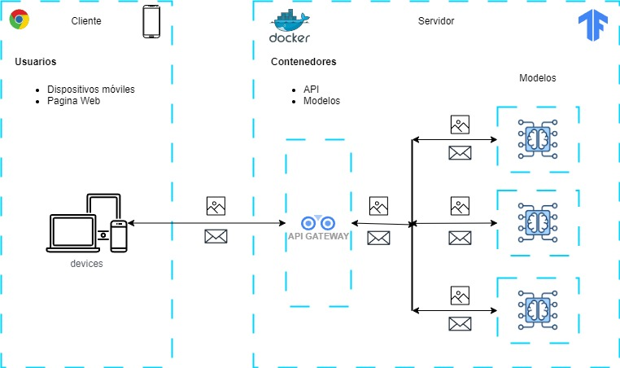
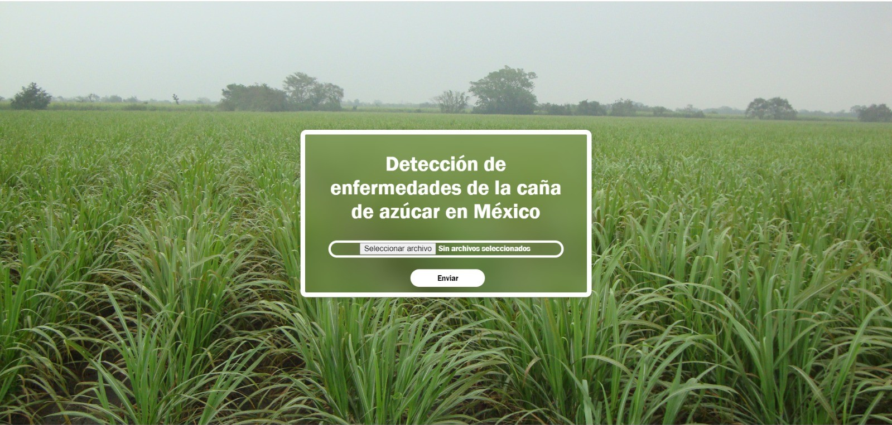
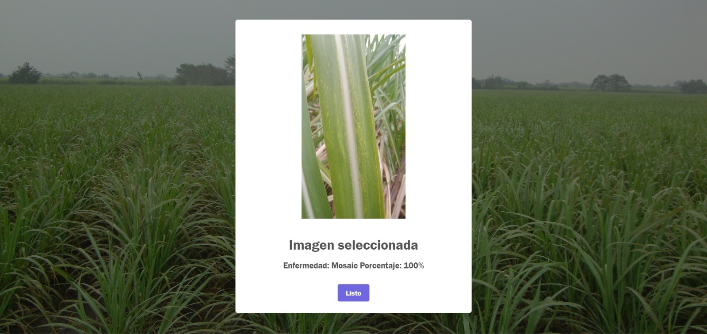

# Aplicación web con el modelo de deep learning EfficientNetV2B0 para la clasificación de enfermedades en la caña de azucar.
Esta aplicación web está diseñada para utilizar el modelo de deep learning EfficientNetV2B0, que permite la clasificación precisa de enfermedades en cultivos de caña de azúcar.

## Objetivo
El objetivo principal de la aplicación es ayudar a los agricultores a detectar y diagnosticar enfermedades de manera rápida y efectiva. Al proporcionar una herramienta accesible y fácil de usar, se busca mejorar la salud de los cultivos y aumentar la productividad, lo que es esencial para garantizar la sostenibilidad de la producción agrícola.

## Características Principales
* __Clasificación Precisa__: Utiliza la arquitectura EfficientNetV2B0, que se ha optimizado para lograr un equilibrio entre precisión y eficiencia computacional.
* __Interfaz Amigable__: La aplicación cuenta con una interfaz intuitiva que permite a los usuarios subir imágenes de sus cultivos y recibir diagnósticos en tiempo real.
* __Resultados Rápidos__: Los usuarios pueden obtener resultados instantáneos, lo que les permite tomar decisiones informadas sobre el manejo de sus cultivos.

## Arquitectura de la aplicación
La arquitectura de la aplicación está diseñada para ser versátil y accesible, permitiendo su uso tanto en ordenadores como en dispositivos móviles. 
Esta basada en una API RESTful que permite la comunicación entre el cliente (interfaz de usuario) y el servidor (modelo de deep learning).

> [!NOTE]
> Se espera en un futuro implementar más modelos con diversidad de cultivos.

## Interfaz gráfica
Página de inicio donde cargas las imagen de tu almacenamiento interno

Página donde te muestra la enfermedad clasificada por el modelo y un porcentaje de certeza.

## Referencias
El trabajo relacionado con el modelo lo encuentras en el siguiente [enlace](https://github.com/JesusDMM/Modelos_IA)
